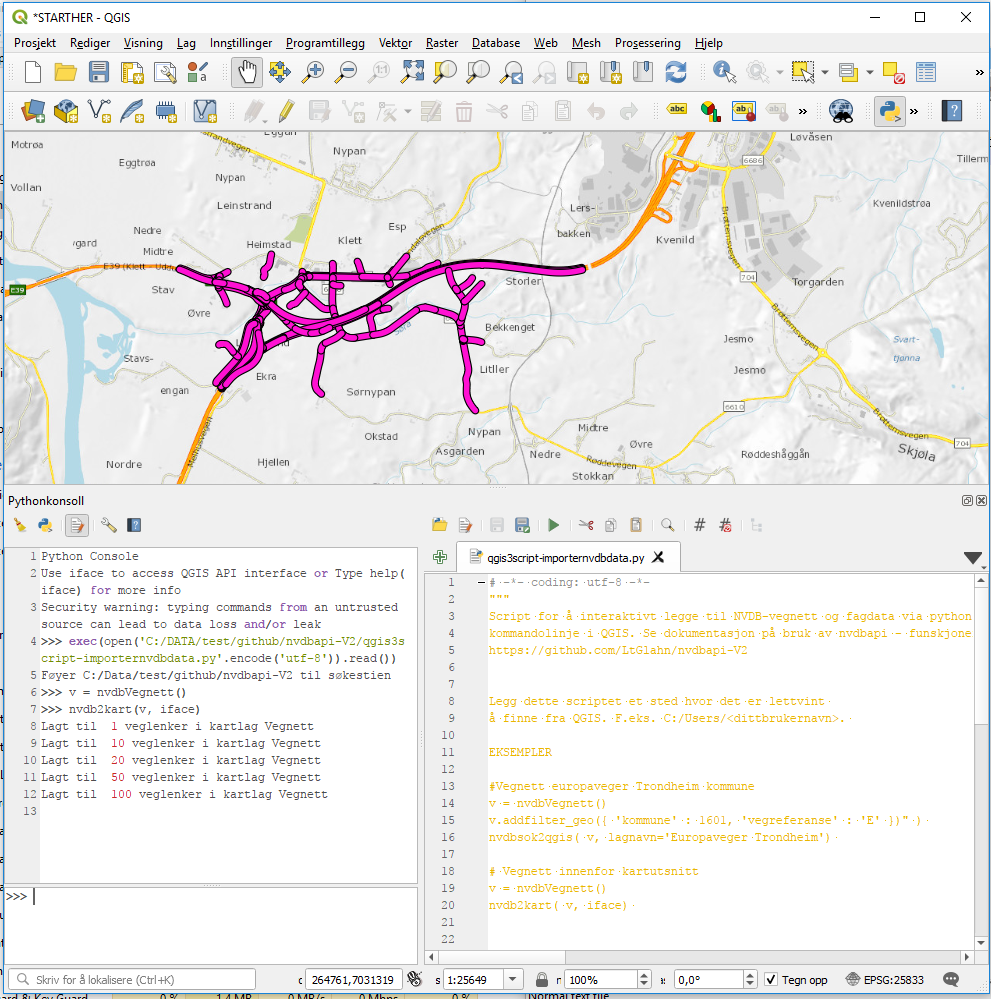
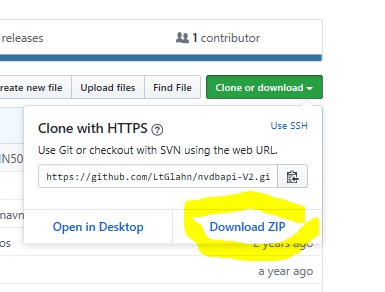
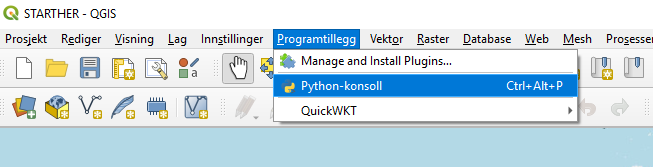
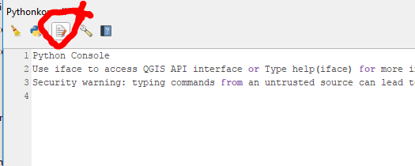
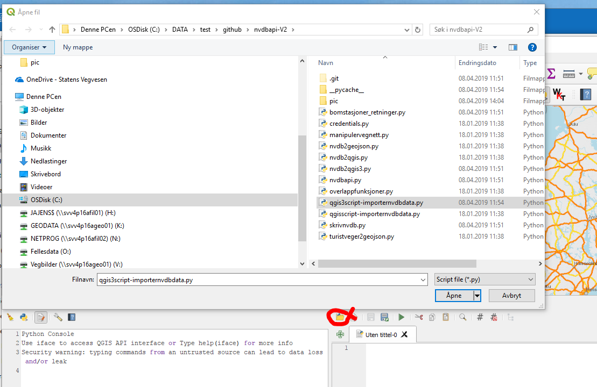
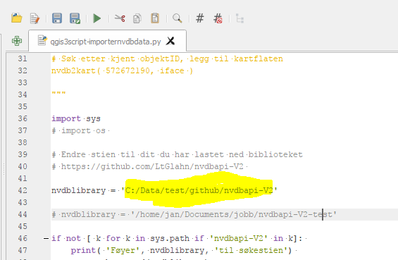
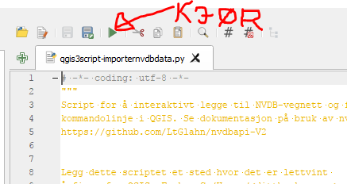

# Les NVDB-data inn i Qgis med kommandoline 

Dette er ikke en grafisk plugin, men et kommandolinjeverktøy hvor du henter 
NVDB data til QGIS med Python-konsollet. Søk, filtrering og nedlasting gjøres med såkalte "søkeobjekter" fra [https://github.com/LtGlahn/nvdbapi-V2](https://github.com/LtGlahn/nvdbapi-V2) (klassene _nvdbVegnett_ eller _nvdbFagdata_). 



### Eksempel - bomstasjoner i Oslo til Qgis 3
Innlesning til Qgis 3 gjøres med kommandoen 
```
sokeobj = nvdbFagdata(45) 
sokeobj.addfilter_geo( {'kommune' : 301 }) # Oslo kommune 
nvdbsok2qgis( sokeobj) 
```

Hvis man vil avgrense søket til kartflaten så bruker man i stedet
```
nvdb2kart( sokeobj, iface) 
```
iface er Qgis sin referanse til kartflaten, og må oppgis for at python-koden skal kunne finne kartflatens hjørnekoordinater. _(

### Eksempel - hent NVDB objekt med ID

```
nvdb2kart( 85751392, iface) 
```

# Installasjon 

  1. Last ned kildekoden [https://github.com/LtGlahn/nvdbapi-V2](https://github.com/LtGlahn/nvdbapi-V2). 
    * Er du ukjent med Github så let etter den grønne knappen "Clone or download". Da kan du laste ned en zip-fil som du pakker ut lokalt på din maskin
  2.  I Qgis: Programtillegg -> Start Python konsoll
  3. I python konsoll: Vis redigeringsmodul
  4. Åpne script. Naviger til filene du pakket ut i steg 1, og åpne fila: 
    * Qgis 3: **qgis3script-importernvdbdata.py**
	* _Qgis 2: qgisscript-importernvdbdata.py_
  5. Rediger søkestien i skriptet! 
    * Variabelen nvdblibrary må ha korrekt sti til mappen der du lagret kildekoden i steg 1. 
	* Lagre **Pro-tip:** _Lagre scriptet med et annet navn, eller i en annen mappe. Da kan du laste ned oppdateringer av nvdbapi-V2 uten å miste dine lokale innstillinger. 
  6. Trykk den grønne "Kjør" - knappen
  7. Nå er du klar til å jobbe interaktivt i python-konsollet!
  
  
### Med bilder 

##### 1. Last ned kildekoden

https://github.com/LtGlahn/nvdbapi-V2](https://github.com/LtGlahn/nvdbapi-V2). 
Er du ukjent med Github så let etter den grønne knappen "Clone or download". Da kan du laste ned en zip-fil som du pakker ut lokalt på din maskin



##### 2. Start Qgis python konsoll



Programtillegg -> Start python konsoll

##### 3. Start redigeringsmodul



##### 4. Åpne script 

Naviger til filene du pakket ut i steg 1, og åpne fila: 
  * Qgis 3: **qgis3script-importernvdbdata.py**
  * _Qgis 2: qgisscript-importernvdbdata.py_
  
 

##### 5. Rediger søkestien

Variabelen nvdblibrary må ha korrekt sti til mappen der du lagret kildekoden i steg 1.



##### 6. Kjør! Klart! 

Trykk den grønne "kjør"-knappen over editorvinduet, og du er klar til å jobbe interaktivt mot NVDB api og Qgis kartflate! 


